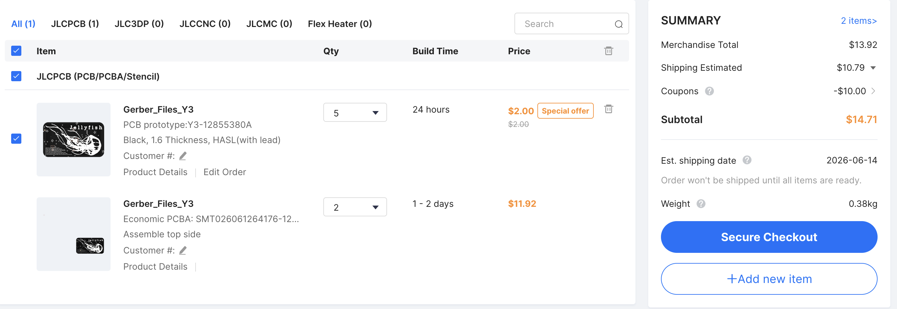

# May 23rd, 2026

I wanted to build an interactive digital business card with 3 main features (maybe more later).

1. An **NFC tag** that automatically opens a link to my digital garden / e-portfolio when scanned by a phone.
2. A **sensor** to read a user's heart rate when they touch the card.
3. A cluster of **LEDs** that flash in sync with their pulse.

I'm extremely new to hardware design, so my main goal today was just getting the foundational stuff down. Here is what the schematic and layout looks like so far:

The absolute hardest part of today was sourcing the right NFC chip. Because the card needs to be slim and run on a tiny coin-cell battery.

I initially stumbled onto the _nRF5340-QKAA-R7_, which features integrated Bluetooth and NFC. However i came to realise that 1. it's a semiconductor and 2. it uses 94 very very very small pins, which would be impossible for me to solder.

Instead, I found a much simpler option, using the **ATtiny85 microcontroller** as the main brain, and as for the NFC functionality, I spent a lot of time digging through SnapEDA and settled on **NT3H2211W0FHKH**

Because it’s a dedicated tag, it features an I2C interface (`SDA` and `SCL`) that shares the exact same data wires as my heart rate sensor, saving valuable pins on the ATtiny85 (from what I understand).Another cool aspect is that it has a `VOUT` energy-harvesting pin and an `FD` (Field Detect) pin that signals the ATtiny85 the exact moment a smartphone interacts with the card's magnetic field (opens doors to some other ideas i could implement).

I plan to design the silkscreen export it, and import the line art directly into KiCad's silkscreen layer. I also want to wrap a custom 4-turn copper loop antenna around the entire outer edge of the card to act as the NFC receiver, while styling the internal copper traces to look like spider webs radiating out from the ATtiny85 brain.

Time Spent: **~2.75 hours**

# May 24th, 2026

It's currently 4 am (Now like 4:50). I woke up motivated to to clean up my design, and I did just that. I found some tips from [this video](https://www.youtube.com/watch?v=S24RvYZWYUQ), and some other forum posts as I worked to clean up my schematic. Now it looks like this:

Much cleaner I'd say, now to move on to figuring how to add images & nice looking text & symbols.

Time Spent: **~45 minutes**

# June 11th, 2026

With the help of auto-router and a copious amount of part shifting I've finally achieved a pretty good result. I had to use this [Youtube tutorial](https://youtu.be/j1Ck5NCs40M?si=HHhHnbbrR60XLGnc) to figure out how to make the NFC antenna, it was much simpler than I thought it'd be. I also used this [website](https://kbeckmann.github.io/nfc-antenna-generator/) to help me create the traces easier but I found too much trouble adjusting it so I ended making the traces by hand. Overall I'd say this was a pretty enlightening experience, now all I have left to do is to make it look nicer & more put together. I added some pictures of jellyfish & fish on the card and I want to add some small text with like "Species, Genus, [small blurb]," for some cool factor, mainly because I got inspired from the text on this other [PCB card](https://forge.hackclub.com/projects/342), I might even change up the whole Silkscreen stuff to make it look like a data card of a jellyfish (i'm very indecisive on what I want it too look like). 

I've also added some contact info for me on the back. It was all made in Inkscape because I got annoyed on working with objects in KiCad. I also found out KiCad does not have a .ttf or .otf font file, so I used a Hershey font from Github as substitute, I think it does pretty well all things considered. 

What's left for me to do now is add final touches and package it for shipping & hopefully it passes!

Back of Card with Jellyfish:

Front of Card with Jellyfish & Fish:

Front Copper Layer:

Back Copper Layer:

Both Copper Layers

Sidenote: The back layer is filled with copper, it's just not shown in the pictures because then it'd look too messy.

Time Spent: **~2 hours**

# June 12th, 2026
At this point, it was just about wrapping everything up. Creating a BOM was pretty straightforward and I liked how JLCPCB lets you export the parts you have on. I, once again, completely changed up the design of my silkscreen and have finalised it, I really like the Jellyfish motif and I think it looks pretty cool. 

[Jellyfish](images/JellyfishPCB.svg)

After that, I made sure everything based the DRC in KiCAD and created my gerber files, I then uploaded into JLCPCB, changed some parameters, and got a pretty good quote. I also spent some time cleaning up the repository, added an MIT license, and made the README look good. I think I can call it done from here, I'm gonna look through the requirements and resubmit.

Time Spent: **~1.25 hours**