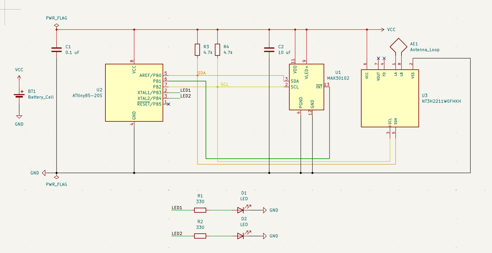
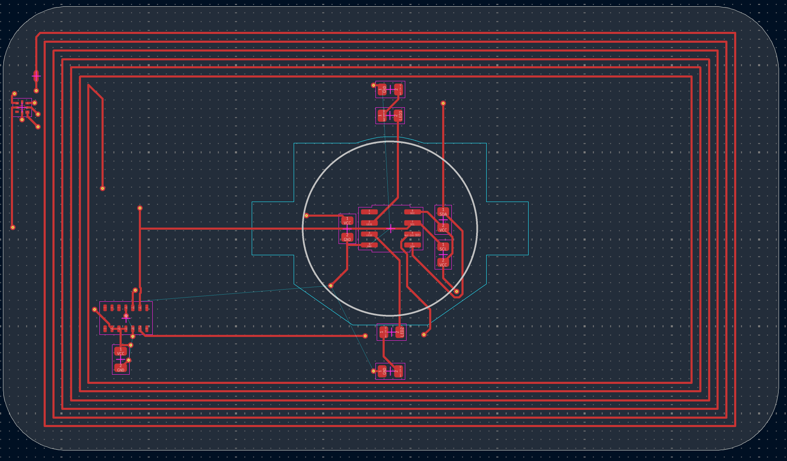
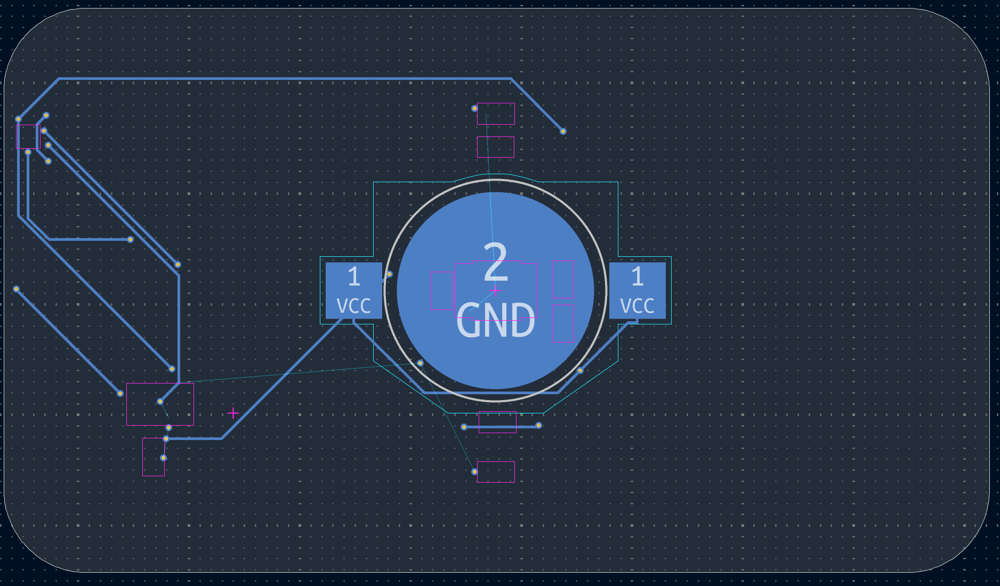
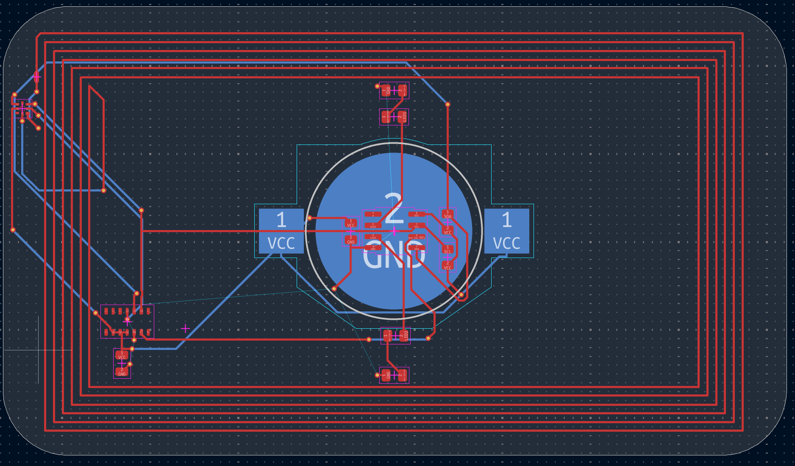
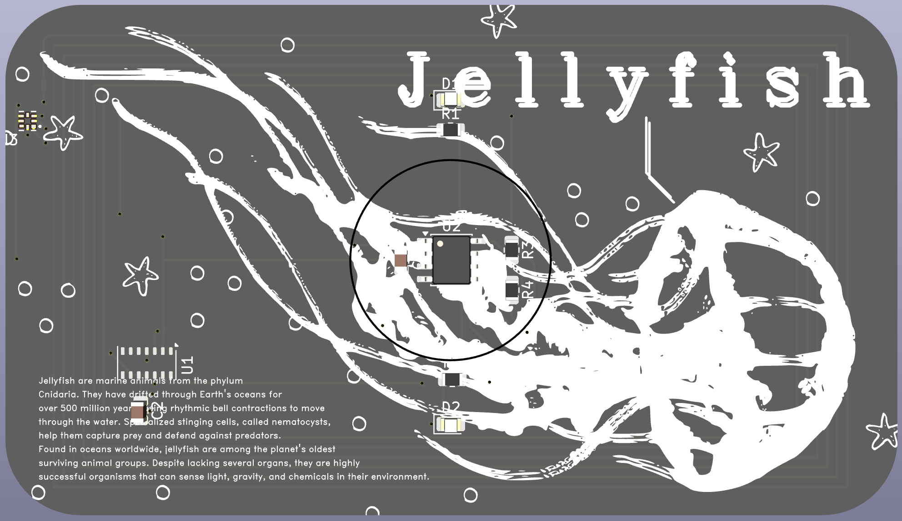

# Jellyfish PCB Card
A custom-designed PCB Business card inspired by [isayx](https://forge.hackclub.com/projects/342) & [ghastly](https://forge.hackclub.com/projects/369). The main goal was to include an NFC chip/antenna to send a portfolio and a heart-rate sensor linked to LEDs as a fun way to create interactions.

I mainly worked on this because I wanted to challenge to construct my fully polished PCB device, and to get my foot in the door in learning electronics, KiCAD, and some SVG editors.

## Schematic

## Silkscreen

## PCB Layout

> Note: Ground Pour on Back Layer is not shown in these images

## 3D Render

## Bill of Materials (for 2 Cards)
| Designator | Part Kind      | Part #             | Manufacturer                         | Product link                                                       | Qty        | Total Price ($) |
|------------|----------------|--------------------|--------------------------------------|--------------------------------------------------------------------|------------|-----------------|
| C1         | 0.1uF          | CC0805KRX7R9BB104  | YAGEO                                | https://jlcpcb.com/partdetail/YAGEO-CC0805KRX7R9BB104/C49678       | 2          | 0.0184          |
| C2         | 10uF           | GRM21BR61H106KE43L | Murata Electronics                   | https://jlcpcb.com/partdetail/439567-GRM21BR61H106KE43L/C440198    | 2          | 0.6418          |
| D1,D2      | LED            | NCD0805R1          | Foshan NationStar Optoelectronics    | https://jlcpcb.com/partdetail/85425-NCD0805R1/C84256               | 4          | 0.0532          |
| R1,R2      | 330            | 0805W8F3300T5E     | UNI-ROYAL(Uniroyal Elec)             | https://jlcpcb.com/partdetail/18318-0805W8F3300T5E/C17630          | 4          | 0.0108          |
| R3,R4      | 4.7k           | 0805W8F4701T5E     | UNI-ROYAL(Uniroyal Elec)             | https://jlcpcb.com/partdetail/18361-0805W8F4701T5E/C17673          | 4          | 0.0084          |
| U1         | MAX30102       | MAX30102EFD+T      | Analog Devices Inc./Maxim Integrated | https://jlcpcb.com/partdetail/7407610-MAX30102EFDT/C6454833        | 0 (2)      | 0 (26.26)       |
| U2         | ATtiny85-20S   | ATTINY85-20SU      | Microchip Technology                 | https://jlcpcb.com/partdetail/MicrochipTech-ATTINY8520SU/C31540447 | 0 (2)      | 0 (5.16)        |
| U3         | NT3H2211W0FHKH | NT3H2211W0FHKH     | NXP Semicon                          | https://jlcpcb.com/partdetail/NXPSemicon-NT3H2211W0FHKH/C2905792   | 0 (2)      | 0 (1.88)        |
| BT1        | CR2032-BS-6-1  | CR2032-BS-6-1      | Q&J                                  | https://jlcpcb.com/partdetail/QJ-CR2032_BS_61/C70377               | 0 (2)      | 0 (0.28)        |
|            |                |                    |                                      |                                                                    | **Total:** | **$34.32 ($17.16 per Card)**          |

> Note: I decided I'd buy the NFC chip, Attiny, Battery Cell & Holder, & Heartbeat myself, which is why they have 0 listed for price and quantity. The main cost is the Attiny. I think I could've found a cheaper option, but it'll do for now.
